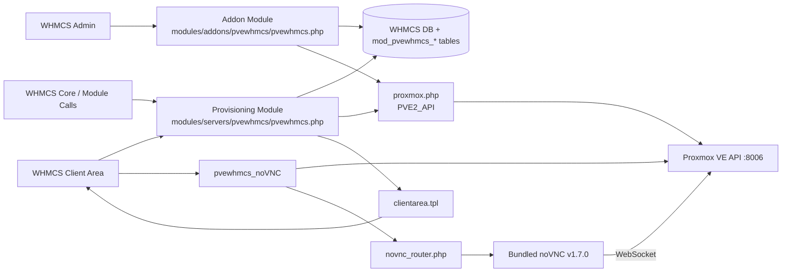
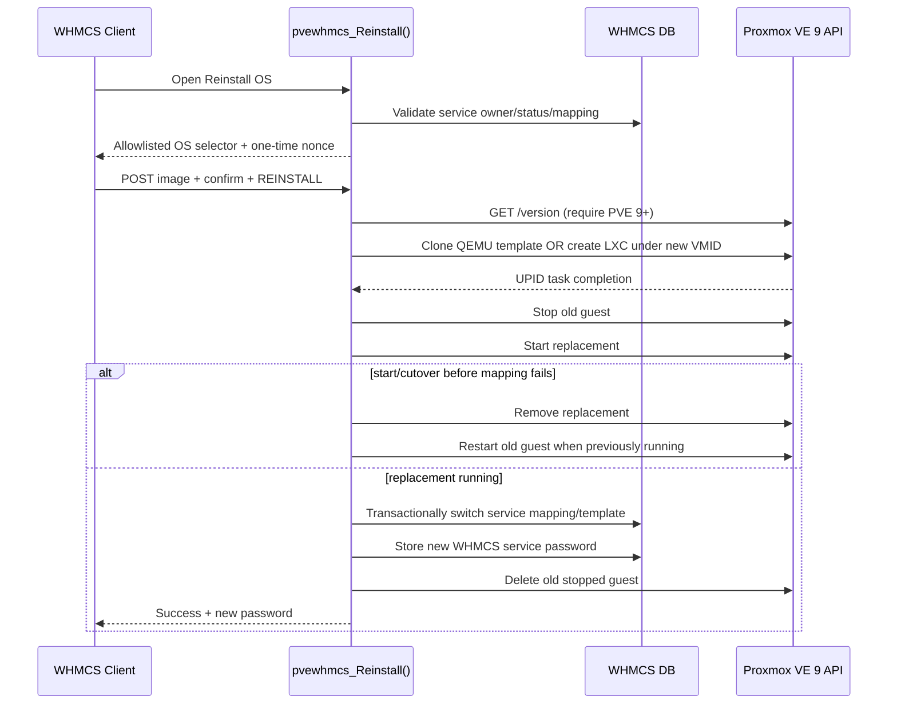
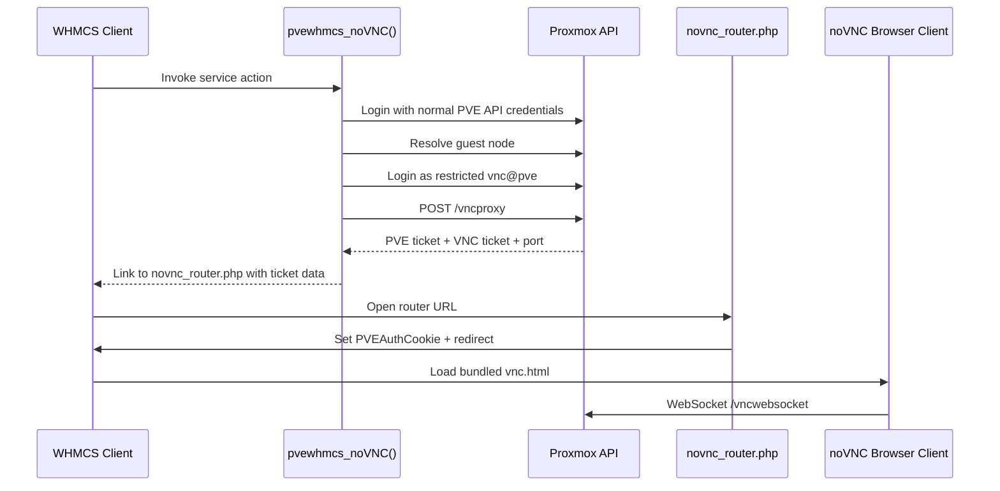

# Proxmox VE for WHMCS — System Map & AI Handoff

> **Purpose:** This is the canonical fast-start map for humans and AI reviewing this repository.  
> Read this file first. Do **not** re-scan vendored noVNC or the whole repository unless the reviewed commit has changed or the task specifically concerns those files.

> **Security remediation:** For the authoritative finding list, severity, evidence, fix requirements and status tracking, read [SECURITY_AUDIT.md](SECURITY_AUDIT.md) immediately after this file. Future AI should use that tracker instead of repeating the full audit.

## 1. Snapshot / provenance

- Repository: `Meysam-sadeghi/Proxmox-VE-for-WHMCS`
- Module version: **1.3.5**
- Default branch: `master`
- Reviewed commit: `7ff41ccecde7e1d846860e3b24208129ee8fdd42`
- Reviewed tree: `5a554988a633335295ff001eb53b8013c07afe5f`
- Review date: **2026-10-07**
- Total repository blobs at reviewed tree: **275**
- Parent/upstream: `The-Network-Crew/Proxmox-VE-for-WHMCS`
- Historical source: `cybercoder/PRVE`
- At the reviewed commit, this fork's `master` is **exactly the same commit/tree as upstream master**. No fork-specific source changes were present.
- **Post-audit source change baseline:** source changes through commit `7b1f3c7a3581cc2f0ab3d05edd292d0994b54ec8` were specifically reviewed for the new Proxmox VE 9+ client reinstall workflow and PVE API HTTP-response compatibility. Documentation commits after that baseline do not change runtime behavior.
- New runtime file after the original audit: `modules/servers/pvewhmcs/reinstall.php`.

### Vendored noVNC integrity

Path: `modules/servers/pvewhmcs/novnc/`

- Bundled version: **noVNC v1.7.0**
- Official noVNC v1.7.0 commit checked: `63107bd06d9e1f6136ff21aeda8cd62cbf0d433e`
- Vendored files in this repo: **208**
- Hash-identical to official v1.7.0: **208 / 208**
- Modified vendored files: **0**
- Official release files not vendored here: 9

**AI rule:** Unless the noVNC version or vendored hashes change, treat this directory as upstream third-party code. For normal module work, do not spend context rereading its 208 files.

---

## 2. Fast path for future AI

Read these files, in this order:

1. `SYSTEM_MAP.md` — this document.
2. `SECURITY_AUDIT.md` — authoritative security finding/remediation tracker.
3. `modules/servers/pvewhmcs/pvewhmcs.php` — provisioning/runtime/client actions.
4. `modules/servers/pvewhmcs/reinstall.php` — Proxmox VE 9+ client reinstall/rebuild workflow.
5. `modules/addons/pvewhmcs/pvewhmcs.php` — WHMCS admin addon UI/config/plans/IP pools/import.
6. `modules/addons/pvewhmcs/proxmox.php` — Proxmox API transport/client.
7. `modules/servers/pvewhmcs/novnc_router.php` — console ticket/cookie routing.
8. `modules/addons/pvewhmcs/db.sql` — module data model.
9. `modules/servers/pvewhmcs/clientarea.tpl` — client-facing VM UI.
10. `README.md` — deployment requirements and expected PVE/WHMCS setup.
11. `SECURITY.md` — upstream disclosure policy.

If HEAD differs from the reviewed commit, first compare the new HEAD against:
`7ff41ccecde7e1d846860e3b24208129ee8fdd42`.
Then inspect only changed files plus their direct callers.

---

## 3. High-level architecture

### Trust boundaries

1. **Internet/client browser ↔ WHMCS**
2. **WHMCS ↔ database**
3. **WHMCS ↔ Proxmox management API**
4. **Browser/noVNC ↔ Proxmox WebSocket**
5. **WHMCS admin users ↔ addon configuration**
6. **Vendored third-party noVNC ↔ first-party routing code**

A compromise across boundary #3 is especially serious because the documented deployment uses a privileged PVE account for normal API work.

---

## 4. Repository map

### Root / project metadata

- `README.md` — installation, PVE users, VNC requirements, product setup.
- `SECURITY.md` — supported version and responsible disclosure rules.
- `CHANGELOG.md` — release history.
- `version` — current module version.
- `LICENSE`, `CONTRIBUTORS.md`
- `.github/ISSUE_TEMPLATE/*` — issue templates.
- `.github/workflows/php-lint.yml` — PHP syntax validation for pushes/PRs that touch PHP sources.
- `_docs/*` — historical/manual/update documentation.
- `_images/*` — documentation screenshots/static images.

### WHMCS addon module

Path: `modules/addons/pvewhmcs/`

- `pvewhmcs.php` — **admin addon controller/UI** (~2399 lines).
- `proxmox.php` — **PVE API client/transport** (~618 lines).
- `db.sql` — module database schema.
- `hooks.php` — currently empty ClientLogin/ClientLogout hook bodies.
- `Ipv4/Address.php` — IPv4 address helper.
- `Ipv4/Subnet.php` — subnet parsing/range logic.
- `Ipv4/SubnetIterator.php` — enumerates every host in a subnet.
- `img/*` — static addon assets.

### WHMCS provisioning/server module

Path: `modules/servers/pvewhmcs/`

- `pvewhmcs.php` — **core service lifecycle/provisioning/client actions**; loads the reinstall module and registers the `Reinstall OS` custom client action.
- `reinstall.php` — **Proxmox VE 9+ destructive reinstall/rebuild workflow**, including allowlisted OS selection, ownership/CSRF/confirmation checks, locking, replacement-first cutover, rollback, password regeneration, and mapping update.
- `clientarea.tpl` — client area UI for status/specs/statistics.
- `novnc_router.php` — standalone console router/cookie setter.
- `whmcs.json` — WHMCS module metadata.
- `js/CircularLoader.js` — client gauge UI.
- `img/*` — VM/OS/status icons.
- `novnc/*` — upstream noVNC v1.7.0 vendor tree; 208 bundled files.

---

## 5. Core entry points and responsibilities

### A. Admin addon — `modules/addons/pvewhmcs/pvewhmcs.php`

Important functions:

- `pvewhmcs_config()` — addon metadata.
- `pvewhmcs_activate()` — reads `db.sql` and creates schema.
- `pvewhmcs_upgrade()` — module migrations.
- `pvewhmcs_output($vars)` — main admin UI/router.
- `import_guest()` — import an existing PVE guest into WHMCS/module mapping.
- `save_config()` — saves VNC secret, starting VMID, debug mode.
- QEMU plan CRUD: `qemu_plan_add`, `qemu_plan_edit`, `save_qemu_plan`, `update_qemu_plan`, `remove_plan`.
- LXC plan CRUD: `lxc_plan_add`, `lxc_plan_edit`, `save_lxc_plan`, `update_lxc_plan`.
- IP pool CRUD: `list_ip_pools`, `add_ip_pool`, `save_ip_pool`, `removeIpPool`, `add_ip_2_pool`, `list_ips`, `removeip`.
- Cluster node/guest views query PVE and display RRD/status data.

Admin tabs include: Nodes, Guests, VM Plans, IPv4 Pools, Actions, Support, Config, Logs.

### B. Provisioning module — `modules/servers/pvewhmcs/pvewhmcs.php`

WHMCS entry points:

- `pvewhmcs_MetaData()`
- `pvewhmcs_AdminLink()`
- `pvewhmcs_ConfigOptions()`
- `pvewhmcs_CreateAccount()`
- `pvewhmcs_TestConnection()`
- `pvewhmcs_SuspendAccount()`
- `pvewhmcs_UnsuspendAccount()`
- `pvewhmcs_TerminateAccount()`
- `pvewhmcs_ClientArea()`

Client/admin actions:

- `pvewhmcs_vmStart()`
- `pvewhmcs_vmReboot()`
- `pvewhmcs_vmShutdown()`
- `pvewhmcs_vmStop()`
- `pvewhmcs_vmCheck()`
- `pvewhmcs_vmStat()`
- `pvewhmcs_noVNC()`
- `pvewhmcs_SPICE()`
- `pvewhmcs_Reinstall()` — loaded from `reinstall.php`; client-visible destructive rebuild action for PVE 9+.

Helpers include VMID allocation, VM/node discovery, RRD fetch, netmask conversion and formatting.

### B1. Reinstall module — `modules/servers/pvewhmcs/reinstall.php`

Key behavior:

- Requires an active WHMCS service owned by the current client and a matching `mod_pvewhmcs_vms` mapping.
- Requires Proxmox VE major version 9+ via `/version`.
- QEMU sources are allowlisted numeric `KVMTemplate` values and must resolve to real PVE templates containing Cloud-Init.
- LXC sources are allowlisted `Template` volume IDs and must exist as `vztmpl` content on a cluster node.
- Uses a one-time per-service session nonce, explicit destructive confirmation and a MySQL advisory lock.
- Generates a replacement under a new VMID before stopping the old guest.
- Reuses the service IP and plan-derived network/resource configuration.
- Starts the replacement before atomically moving the WHMCS mapping.
- If startup or pre-mapping cutover fails, removes the replacement and best-effort restarts the old guest.
- Generates a new strong guest password and stores it with WHMCS `UpdateClientProduct`; passwords are not written to module logs by this workflow.
- Deletes the old stopped guest only after the new guest is running and mapped.

### C. Proxmox API transport — `modules/addons/pvewhmcs/proxmox.php`

Class: `PVE2_API`

Responsibilities:

- Login to `/api2/json/access/ticket`.
- Retain PVE authentication ticket + CSRF token in memory.
- Send GET/POST/PUT/DELETE requests.
- Parse HTTP status/body using libcurl response metadata rather than assuming an `HTTP/1.1` status line, improving compatibility with PVE 9 / HTTP/2-capable transports.
- Discover nodes/guests.
- Wrapper operations for start/stop/shutdown/resume/suspend/clone/snapshot/version.

### D. noVNC router — `modules/servers/pvewhmcs/novnc_router.php`

Receives PVE/noVNC ticket data from query parameters, sets `PVEAuthCookie` for the parent domain, and redirects the browser into bundled noVNC with host/port/password/path parameters.

This file is independently web-accessible and is security-sensitive.

---

## 6. Data model

Created by `modules/addons/pvewhmcs/db.sql`.

### `mod_pvewhmcs`
Singleton module config:
- `vnc_secret`
- `start_vmid`
- `debug_mode`
- legacy `config`

### `mod_pvewhmcs_vms`
Primary service-to-guest mapping:
- `id` = WHMCS service ID (primary key)
- `vmid` = PVE VM/CT ID
- `node_id`
- `user_id`
- `vtype` = qemu/lxc
- IPv4 address, subnet mask, gateway
- creation timestamp
- IPv6 mode/prefix field

### `mod_pvewhmcs_plans`
Resource/network plan:
CPU, cores, memory, swap, disk, storage, disk format/cache/type/I/O, bridge, NIC model, rate, firewall, VLAN, IPv6 mode, ballooning, KVM, onboot, unprivileged mode, SSH-key field.

### `mod_pvewhmcs_ip_pools`
- pool title
- gateway

### `mod_pvewhmcs_ip_addresses`
- pool ID
- unique IPv4 address
- subnet mask

### Other/legacy or future-facing tables

- `mod_pvewhmcs_iso`
- `mod_pvewhmcs_logs`
- `mod_pvewhmcs_nodes`
- `mod_pvewhmcs_ssh_keys`
- `mod_pvewhmcs_templates`

The live provisioning flow also reads/writes standard WHMCS tables including `tblservers`, `tblhosting`, `tblclients`, `tblproducts`, and server-group relationships.

---

## 7. Provisioning flow

### Common preparation

1. WHMCS calls `pvewhmcs_CreateAccount($params)`.
2. Module loads selected module plan and IP pool.
3. It selects the first unused IPv4 using a parameterized SQL query.
4. It reserves that IP in `tblhosting.dedicatedip`.
5. It loads starting VMID and connects to PVE.
6. It finds the next free VMID.

### QEMU template clone path

Triggered when custom field `KVMTemplate` is present.

1. Determine template node from `TPL_Node_QEMU` or auto-discover template VMID.
2. Clone template to a new VMID.
3. Poll the returned PVE UPID until task completion.
4. Insert service mapping into `mod_pvewhmcs_vms`.
5. Apply plan settings (CPU/RAM/OS/onboot/network/cloud-init).
6. Optional cloud-init password comes from WHMCS password or custom field `Password`.
7. Start VM when configured.

### Fresh QEMU/LXC creation path

1. Build PVE VM/CT settings from module plan.
2. LXC uses custom fields such as `Template`, `Password`, optional `TPL_Node_LXC`.
3. QEMU can attach ISO and configure NIC/bridge/VLAN/firewall.
4. Submit create request to PVE.
5. Poll task status.
6. Persist mapping and dedicated IP.

---

## 8. Service lifecycle flow

WHMCS service ID is resolved to `mod_pvewhmcs_vms`, then to PVE VMID/type/node.

- **Suspend:** stop guest.
- **Unsuspend:** start guest.
- **Terminate:** identify mapped VM, guard against duplicate VMID ownership, stop if needed, delete from PVE, remove module mapping.
- **Client actions:** start, reboot, graceful shutdown, hard stop, status/statistics, noVNC, and Reinstall OS.
- **Client Area:** decrypt WHMCS-stored PVE server password via WHMCS local API, connect to PVE, fetch config/resource status/RRD data, pass normalized data to `clientarea.tpl`.
- **Reinstall:** validates client/service ownership and an allowlisted PVE template, creates a replacement under a new VMID, stops the old guest only after staging succeeds, starts the replacement with the same service IP/plan, atomically swaps the service mapping, stores the new password, then deletes the old guest. Pre-mapping failures roll back to the old guest.

### Reinstall sequence

---

## 9. Console / noVNC flow

The README requires a restricted `vnc@pve` user with `VM.Console` permission only. Keep that separation if console support remains enabled.

---

## 10. Secrets and sensitive data

Security-sensitive material handled by the module:

- WHMCS-stored PVE server username/password.
- PVE authentication ticket.
- PVE CSRF prevention token.
- Module `vnc_secret` (password for `vnc@pve`).
- noVNC/VNC proxy ticket.
- VM/LXC customer/root/cloud-init passwords.
- Public SSH keys and full guest configuration.
- Client/service IDs and PVE VMIDs.
- Network allocations/gateways/VLAN configuration.

Never add any of the above to logs, URLs, commits, support screenshots, or exception output without deliberate redaction.

---

## 11. Security-sensitive hotspots discovered in the 2026-10-07 review

This section is intentionally concise; it is an engineering map, not an exploit guide.

1. **TLS verification:** `proxmox.php` defaults certificate verification off and the generic API action path explicitly disables peer/host verification. This is a priority hardening area.
2. **Privilege level:** documented normal PVE API setup uses a highly privileged account. Reduce to a dedicated least-privilege API identity/token when refactoring.
3. **Module logging:** some debug/error paths pass full WHMCS `$params` or all custom fields to `logModuleCall`; these structures may contain server and guest passwords. Always use redaction/`replaceVars`.
4. **Console tickets:** noVNC flow transports bearer-style PVE/VNC tickets through URL parameters; router is standalone and not bound to a one-time WHMCS session nonce.
5. **Console cookie:** router writes `PVEAuthCookie` across a parent domain with `HttpOnly=false` and `SameSite=None`; sibling-domain/XSS blast radius should be treated as sensitive.
6. **Admin state changes:** plan/IP deletion is performed through GET actions; addon forms do not visibly implement module-level CSRF tokens. Convert mutations to POST + WHMCS token validation.
7. **Output encoding:** multiple addon DB values and multiple client template values are rendered without explicit contextual escaping. Apply output encoding consistently.
8. **VNC secret storage:** `vnc_secret` is stored in module DB and rendered into a normal text input. Treat it as a credential; encrypt/mask it.
9. **IPv4 range expansion:** `add_ip_2_pool()` enumerates every host from the submitted CIDR with no upper bound. Large ranges can exhaust CPU/time/database resources.
10. **Legacy crypto:** old SHA1/MD5/XOR-style helper code remains in the provisioning file. It appears dormant in the current active flow and should be removed rather than reused.
11. **Ticket-age check:** the PVE API client's local ticket-age comparison is logically reversed; fix for correctness even though normal module requests create short-lived objects.
12. **Bundled noVNC ZRLE decoder:** noVNC upstream issue #2072 reports an unbounded plain-RLE run length causing client-side CPU exhaustion. The bundled v1.7.0 `core/decoders/zrle.js` was checked and contains the reported missing bound; treat this as an applicable availability bug until upstream/fork is patched.
13. **noVNC destination parameters:** upstream issue #2051 tracks untrusted URL-controlled WebSocket destinations. This module's router also accepts host/port/path inputs and forwards them into noVNC, so destination allowlisting and CSP should be part of the console redesign.

### Negative findings from the static review

At the reviewed commit, no first-party evidence was found of:

- shell command execution/backdoor primitives such as `exec`, `shell_exec`, `system`, or `passthru`;
- dynamic include/require paths controlled by end-user input;
- arbitrary file upload/write functionality;
- obvious SQL injection in active provisioning queries (query builder/bound parameter usage is present);
- obfuscated remote payload execution;
- hidden external credential-exfiltration endpoints.

The only intentional remote check in addon code outside configured PVE communication is the module version lookup from the upstream GitHub raw version file.

**Important:** A static source review does not prove a deployed WHMCS/PVE host is uncompromised. Runtime files, web-server configuration, database contents, PHP extensions, cron jobs, WHMCS hooks outside this repository, and PVE host state require separate incident-response inspection.

---

## 12. Change-impact map

When changing:

- **Provisioning, templates, IP allocation:** inspect `modules/servers/pvewhmcs/pvewhmcs.php`, `modules/servers/pvewhmcs/reinstall.php`, `db.sql`, and addon plan/IP forms.
- **Reinstall/rebuild/client destructive actions:** inspect `reinstall.php`, the custom-button registration in `pvewhmcs.php`, WHMCS product `KVMTemplate`/`Template` field conventions, PVE task polling, rollback, service mapping and password persistence.
- **PVE authentication/networking:** inspect `proxmox.php` and every `new PVE2_API(...)` caller.
- **Client UI/XSS/escaping:** inspect `clientarea.tpl` plus variables assembled by `pvewhmcs_ClientArea()`.
- **Admin UI/CSRF/XSS:** inspect `modules/addons/pvewhmcs/pvewhmcs.php`.
- **Console/noVNC:** inspect `pvewhmcs_noVNC()`, `novnc_router.php`, README console requirements, and only then vendored noVNC if necessary.
- **Schema:** inspect `db.sql`, `pvewhmcs_activate()`, `pvewhmcs_upgrade()`, and all table callers.
- **Logging/privacy:** search `logModuleCall`, `debug_mode`, exception handlers, and any serialization of `$params`, custom fields, PVE config, or tickets.

---

## 13. AI maintenance protocol

When this repository changes:

1. Read this file.
2. Get current HEAD SHA.
3. The original full-repository security baseline is `7ff41ccecde7e1d846860e3b24208129ee8fdd42`.
4. Post-audit runtime changes for Reinstall/PVE9 transport were reviewed through `7b1f3c7a3581cc2f0ab3d05edd292d0994b54ec8`. If current HEAD differs from that source baseline, compare from `7b1f3c7a3581cc2f0ab3d05edd292d0994b54ec8` first; then inspect changed files and callers.
5. Re-evaluate trust boundaries for any new endpoint, hook, API call, database table, secret, or client-visible value.
6. If noVNC version changes, re-run a vendor hash comparison against the exact upstream release/tag.
7. Update this document's snapshot, flows, file/function map, data model, and security hotspots in the same PR/commit as architectural changes.
8. Never assume this file overrides source code; it is an index and handoff. Source + current diff remain authoritative.

---

## 14. Recommended hardening order

1. Enforce TLS certificate verification for all PVE API traffic.
2. Stop using a root-equivalent PVE identity; introduce a dedicated least-privilege API user/token.
3. Redact all WHMCS module logs and purge historical logs containing secrets.
4. Redesign noVNC ticket delivery so bearer credentials are not exposed in URLs and are session/nonce-bound.
5. Add CSRF-safe POST-only mutations and centralized input validation.
6. Add contextual escaping to admin/client outputs.
7. Encrypt/mask `vnc_secret`; rotate it after migration.
8. Bound IPv4 CIDR imports.
9. Remove dead legacy crypto and obsolete code.
10. Add automated static analysis/security tests and regression tests for service ownership and console authorization.

